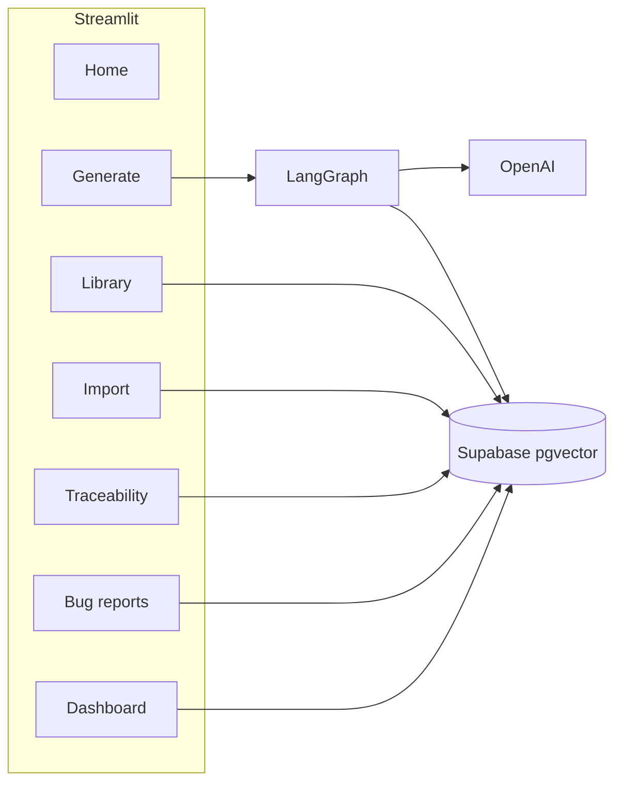

# TestCraft AI

## Problem & goal

QA teams spend significant time turning requirement documents into manual test cases while keeping traceability to source specs and awareness of past defects. Requirements, bug history, and existing tests often live in separate tools, so new coverage can miss regressions that already appeared on the same screen, service, or functional area.

**TestCraft AI** addresses that gap: upload a requirement document, optionally import project bugs and test cases, and run a **multi-agent pipeline** that produces structured, review-ready manual tests linked to requirement IDs. Retrieval-augmented generation (RAG) over **Supabase pgvector** surfaces relevant history before each requirement is written up, so generated cases can reflect real regression risk—not generic templates.

**How it works (summary):** documents are chunked and embedded at prepare time; **LangGraph** runs an Analyst step, scope-aware per-rule retrieval, parallel test generation, optional coverage review, deduplication, and persistence. **Streamlit** provides ingest, generation, semantic library search, a traceability matrix, and CSV/XLSX export. Optional **[LangSmith](https://smith.langchain.com)** tracing records each pipeline run for debugging and evaluation.

**Capstone alignment:** primarily **Case 2** (AI agent for task automation), with **Case 1** (RAG-grounded generation) and **Case 3** (document ingest + semantic search) as supporting pillars. Vector storage uses **pgvector** on Supabase (same RAG pattern as ChromaDB-style stores, on Postgres).

## Project framing (SCR & SMART)

**SCR (Situation → Complication → Resolution)**

| | |
|---|---|
| **Situation** | QA maintains requirements, historical bugs, and test libraries; manual test design is repetitive and must stay traceable to specs. |
| **Complication** | Writing cases from prose is slow; new features may not reuse lessons from prior bugs on the same checkout flow, API, or audit area. |
| **Resolution** | TestCraft AI ingests requirements, retrieves scope-aware project history via RAG, and runs a bounded LangGraph workflow to generate linked test cases with coverage checks, dedup, and export. |

**SMART objectives (demo scope)**

- **Specific:** Generate manual test cases (positive / negative / boundary / edge by level) from requirement docs with `linked_requirement` and chunk UUID traceability.
- **Measurable:** Exhaustiveness quotas per rule (e.g. Smoke = 1 positive + 1 negative per requirement); traceability matrix counts cases per requirement ID.
- **Achievable:** End-to-end demo in ~5 minutes using `sample_data/` — see [Verification](#evaluation) and [`docs/VERIFICATION.md`](docs/VERIFICATION.md).
- **Relevant:** Supports real QA workflows: import history, generate from specs, search library, export to spreadsheets.
- **Time-bound:** Single prepare + generate run completes in minutes for sample docs (exact time depends on model and rule count).

## Architecture



**Generation graph:** ID-aware ingest preserves source requirement IDs (`FR-2.2`, `US-103`, `REQ-12`, `1.2.3`; prose docs get synthetic `REQ-01`, `REQ-02`, ...). `analyze_requirements` normalizes those requirements and tags a `scope` → `retrieve_history_per_rule` performs scope-aware RAG per requirement → `generate_cases` runs one LLM call per requirement (parallel workers) → `enrich_rag_links` → `review_coverage` (optional regen, default **0** rounds) → `validate_dedup` → `persist`. The Generate page streams step-by-step progress via `app.stream()`.

**Exhaustiveness levels** (Generate page): **Smoke**, **Standard**, **Exhaustive** — per-requirement quotas enforced by the coverage reviewer.

**Scope-aware RAG:** Each requirement is tagged with a `scope` — preferred as a UI screen (e.g. `Checkout`), otherwise a service / endpoint (`OrderService`, `POST /api/payments`), otherwise a functional area (`AuthN`, `Audit`, `Performance`), and `General` only as a last resort. The requirement is embedded as `Scope: <scope>. Module: <module>. Requirement: ...` and queried against pgvector. A bug on **payments** in **Checkout** surfaces for a **coupon-code** requirement in **Checkout** because both share the scope value. Requirements tagged `General` skip the scope prefix and fall back to pure semantic similarity. No SQL filter is applied.

**Performance env vars:** `GEN_RULE_BATCH_SIZE` (default `8`), `GEN_PARALLEL_WORKERS` (default `3`), `MAX_COVERAGE_REVIEW_ROUNDS` (default `0`), `RETRIEVAL_TOP_K_PER_RULE` (default `4`), `RAG_LINK_MIN_SIMILARITY` (default `0.55`).

**RAG demo:** Import bugs/TCs first; Generate page shows per-requirement retrieval queries, retrieved history, and per-case links (`supporting_bug_ids` / `supporting_test_case_ids`) with rationale. Exports use QA-friendly columns: `TestCase_ID`, `Requirement_ID`, `Test_Case_Type`, `Test_Scenario`, `Preconditions`, `Test_Steps`, `Expected_Result`.

## Prerequisites

- Python **3.10+**
- [Anaconda](https://www.anaconda.com/) or [Miniconda](https://docs.conda.io/en/latest/miniconda.html) (recommended env name: **`test_project4`**) — or a plain Python install for [uv-only](#local-run-uv-only-optional) setup
- [uv](https://docs.astral.sh/uv/) — installs locked dependencies from [`uv.lock`](uv.lock)
- [Supabase](https://supabase.com/) project with all SQL migrations applied (see below)
- [OpenAI](https://platform.openai.com/) API key

## Quick start (after clone)

```powershell
git clone <your-repo-url>
cd "Capstone Project"          # repository root
conda create -n test_project4 python=3.11 -y   # once; any 3.10+ is fine
conda activate test_project4
$env:UV_PROJECT_ENVIRONMENT = $env:CONDA_PREFIX
uv sync --python "$env:CONDA_PREFIX\python.exe"
copy .env.example .env           # Windows (use cp on macOS/Linux)
# Edit .env with your OpenAI and Supabase keys — never commit .env
```

Apply [Supabase migrations](#supabase-setup) in your project, then:

```powershell
streamlit run app.py
```

Open the URL shown in the terminal (usually `http://localhost:8501`).

## Supabase setup

1. Create a project at [supabase.com](https://supabase.com/).
2. Open **SQL Editor** and run each migration **in order** (copy/paste the full file contents, run, then next):

| Order | File | Purpose |
|-------|------|---------|
| 1 | [`sql/migrations/001_init.sql`](sql/migrations/001_init.sql) | `vector` extension, core tables, `match_*` RPCs |
| 2 | [`sql/migrations/002_bug_number.sql`](sql/migrations/002_bug_number.sql) | External bug IDs (`bug_number`) |
| 3 | [`sql/migrations/003_testcase_id.sql`](sql/migrations/003_testcase_id.sql) | External test case IDs (`testcase_id`) |
| 4 | [`sql/migrations/004_requirement_id.sql`](sql/migrations/004_requirement_id.sql) | Source requirement IDs on chunks + updated RPC |

3. In **Project Settings → API**, copy the project URL and **service role** key into `.env` (see [Environment variables](#environment-variables)).

**Commit `sql/migrations/` to GitHub** — these are schema scripts, not secrets. Each reviewer uses their own Supabase project and keys.

## Local run (Conda + uv, recommended)

Use Conda for the Python environment and **uv** for reproducible installs (no hand-edited `requirements.txt` for day-to-day dev).

**Windows (PowerShell):**

```powershell
cd "Capstone Project"
conda activate test_project4
$env:UV_PROJECT_ENVIRONMENT = $env:CONDA_PREFIX
uv sync --python "$env:CONDA_PREFIX\python.exe"
copy .env.example .env
streamlit run app.py
```

**macOS / Linux (bash):**

```bash
cd "Capstone Project"
conda activate test_project4
export UV_PROJECT_ENVIRONMENT="$CONDA_PREFIX"
uv sync --python "$CONDA_PREFIX/bin/python"
cp .env.example .env
streamlit run app.py
```

- `UV_PROJECT_ENVIRONMENT` tells uv to install into the active Conda env instead of creating `.venv`.
- After `uv add <package>`, run the same `uv sync` command with your env active.
- **IDE:** open this folder and select interpreter **`test_project4`**. `.vscode/settings.json` defaults to `%USERPROFILE%\anaconda3\envs\test_project4` on Windows; adjust if your Conda install lives elsewhere.
- Avoid plain `uv sync` without `UV_PROJECT_ENVIRONMENT` — that maintains a separate gitignored `.venv`.

If `uv sync --active` does not detect Conda:

```powershell
$env:VIRTUAL_ENV = $env:CONDA_PREFIX
uv sync --active
```

## Local run (uv-only, optional)

```bash
cd "Capstone Project"
uv sync
cp .env.example .env    # Windows: copy .env.example .env
uv run streamlit run app.py
```

Upgrade locked versions: `uv lock --upgrade` then `uv sync`.

## Environment variables

Copy [`.env.example`](.env.example) to `.env` and fill in values. **Never commit `.env`** or [`.streamlit/secrets.toml`](.streamlit/secrets.toml).

| Variable | Required | Description |
|----------|----------|-------------|
| `OPENAI_API_KEY` | yes | OpenAI API key |
| `SUPABASE_URL` | yes | Supabase project URL |
| `SUPABASE_SERVICE_ROLE_KEY` | yes | Service role key (server-side only; Streamlit backend) |
| `OPENAI_CHAT_MODEL` | no | Default `gpt-4o-mini` |
| `OPENAI_EMBEDDING_MODEL` | no | Default `text-embedding-3-small` (1536 dims) |
| `MAX_COVERAGE_REVIEW_ROUNDS` | no | Default `0` |
| `GEN_RULE_BATCH_SIZE` | no | Default `8` |
| `GEN_PARALLEL_WORKERS` | no | Default `3` |
| `RAG_LINK_MIN_SIMILARITY` | no | Default `0.55` |
| `ANALYST_MAX_RULES` | no | Default `20` |
| `RETRIEVAL_TOP_K` | no | Default `12` |
| `RETRIEVAL_TOP_K_PER_RULE` | no | Default `4` |
| `RETRIEVAL_MATCH_THRESHOLD` | no | Default `0.15` |
| `DEDUP_SIMILARITY_THRESHOLD` | no | Default `0.88` |
| `LIBRARY_SEARCH_THRESHOLD` | no | Library semantic search threshold (default `0.25`) |
| `LIBRARY_SEARCH_MATCH_COUNT` | no | Library search result cap (default `25`) |
| `LANGCHAIN_TRACING_V2` | no | Set `true` to send LangGraph/LangChain traces to LangSmith |
| `LANGCHAIN_ENDPOINT` | no | Default `https://api.smith.langchain.com` |
| `LANGCHAIN_API_KEY` | no | LangSmith API key (when tracing enabled) |
| `LANGCHAIN_PROJECT` | no | LangSmith project name for grouping runs |

See `.env.example` for the full list and comments.

## LangSmith (optional — LLM run tracing)

This is **not** the same as the in-app **Traceability Matrix** (`pages/Traceability.py`), which maps **requirements → test cases** for QA. **LangSmith** records **LangGraph / LangChain** execution traces (spans, prompts, tool calls, latency, errors) while you run the generation pipeline.

LangSmith is pulled in automatically via LangChain; no extra app code is required — enable it with environment variables in `.env`:

```env
LANGCHAIN_TRACING_V2=true
LANGCHAIN_ENDPOINT=https://api.smith.langchain.com
LANGCHAIN_API_KEY=lsv2_pt_...          # from https://smith.langchain.com → Settings → API keys
LANGCHAIN_PROJECT=TestGeneration-AI    # any label you choose in the LangSmith UI
```

The SDK also accepts `LANGSMITH_*` prefixes (e.g. `LANGSMITH_TRACING`, `LANGSMITH_API_KEY`) instead of `LANGCHAIN_*`.

**Setup:**

1. Sign up at [smith.langchain.com](https://smith.langchain.com) and create a project.
2. Copy the variables above into `.env` (see commented block in `.env.example`).
3. Run **Generate → Run generation pipeline**; open your project in LangSmith to inspect each graph step and LLM call.

Leave tracing unset or `LANGCHAIN_TRACING_V2=false` if you do not need observability. **Never commit** real LangSmith keys — only placeholders in `.env.example`.

## Usage flow

1. **Home:** open the app; use the sidebar to navigate.
2. **Settings:** create a project (sets active `project_id` in session).
3. **Import:** upload `sample_data/sample_bug_reports.csv` and `sample_data/sample_test_cases.csv` (or your own — see Import page help).
4. **Generate:** upload a requirement file (PDF/DOCX/TXT), **Prepare requirements**, then **Generate test cases**. (With [LangSmith](#langsmith-optional--llm-run-tracing) enabled, inspect the same run in the LangSmith UI.)

**Requirement ID parsing:** Supports `FR-2.4:` on one line and `FR-2.4` on its own line with text below. If layout looks ambiguous (e.g. duplicate `FR-2-2` suffixes), Step 2 runs the Analyst LLM once (~20–45s) to repair IDs. Clean docs skip that extra call.
5. **Library:** semantic search, filters, export CSV or Excel.
6. **Traceability matrix:** requirements → linked test cases (optional module filter). This is **QA traceability**, separate from LangSmith **LLM tracing**.
7. **Bug reports** / **Dashboard:** browse imported bugs and project metrics.

Sample requirement text: [`sample_data/sample_requirements.txt`](sample_data/sample_requirements.txt).

## Publishing to GitHub

**Include:** application code, `pyproject.toml`, `uv.lock`, `sql/migrations/`, `sample_data/`, `.env.example`, `.streamlit/config.toml`, `docs/`, README.

**Do not commit:**

| Path | Reason |
|------|--------|
| `.env` | API keys, Supabase service role, LangSmith keys |
| `.streamlit/secrets.toml` | Streamlit Cloud secrets |
| `.venv/`, `venv/` | Local environment (recreate with `uv sync`) |
| `__pycache__/`, `*.pyc` | Python cache |
| `*.xlsx` | Generated exports |
| `_scratch_verify.py` | Local scratch script (gitignored) |

Before pushing: run `git status` and confirm `.env` is not listed. If keys were ever pushed, rotate them in OpenAI and Supabase dashboards.

## Streamlit Cloud (optional deploy)

1. Push the repository to GitHub.
2. Create a [Streamlit Community Cloud](https://streamlit.io/cloud) app pointing to `app.py`.
3. Add the same variables as `.env` under **Secrets** (TOML format).

If the host requires `requirements.txt`:

```bash
uv export --no-hashes --format requirements-txt -o requirements.txt
```

Commit that file only if the host requires it, or generate it in CI and keep it gitignored.

## Evaluation

See [`docs/VERIFICATION.md`](docs/VERIFICATION.md) for a lightweight gold-style checklist, scope-aware RAG demo script, and E2E steps (no RAGAS dependency required). Use it for self-review and the capstone demo video.

## Demo video

Record a ~5 minute walkthrough: create project → import CSVs → ingest requirements → run pipeline (show reasoning / loop-back if triggered) → library search → traceability → export. Upload per your course instructions.

## Project layout

| Path | Purpose |
|------|---------|
| `app.py` | Streamlit navigation entrypoint |
| `Home.py` | Home + project selection |
| `pages/Dashboard.py` | Project metrics |
| `pages/Generate.py` | Requirement ingest + LangGraph pipeline |
| `pages/Library.py` | Semantic search and export |
| `pages/Traceability.py` | Requirements traceability matrix |
| `pages/Bugs.py` | Bug report browser |
| `pages/Import.py` | CSV/XLSX import for bugs and test cases |
| `pages/Settings.py` | Projects and configuration help |
| `theme.py` | Shared Streamlit styling |
| `agent/` | LangGraph graph, state, prompts, nodes |
| `services/` | Supabase repo, embeddings, parsing, ingest, export |
| `sql/migrations/` | Postgres schema + RPC (run in order in Supabase) |
| `sample_data/` | Demo CSV/TXT for import and generation |
| `docs/VERIFICATION.md` | Manual verification checklist |
| `pyproject.toml` / `uv.lock` | Dependencies and lockfile |
| `.env.example` | Environment variable template (safe to commit) |

## Ethics & data handling

- **Human review:** Generated tests are drafts for QA review—not autonomous pass/fail verdicts on production systems.
- **Third-party APIs:** Requirement text and retrieved context are sent to **OpenAI** for embeddings and generation; use only data you are allowed to process under your organisation’s policy.
- **Storage:** Project data (requirements, bugs, test cases) is stored in **your** Supabase project, scoped by `project_id`. Do not commit `.env` or API keys; use `.env.example` as a template.
- **Credentials:** The Supabase **service role** key is used server-side by Streamlit only and must never be exposed to browsers or committed to Git.
- **Demo data:** `sample_data/` is synthetic/educational—avoid uploading real customer PII or production secrets for capstone demos.
- **Bias & gaps:** LLMs may under-cover edge cases or over-fit to retrieved history; exhaustiveness levels and coverage review reduce but do not eliminate that risk—validators remain responsible for sign-off.
- **Hallucination risk:** Titles, steps, and expected results should be checked against the source requirement and product behaviour before use in a test management system.

## Limitations (v1)

- Service role key must never be exposed to browsers; this app is server-side Streamlit only.
- Analyst-derived atomic requirements (e.g. `REQ-01-1`, `REQ-01-2`) are not stored as separate rows in `requirements`; traceability is via `test_cases.linked_requirement` and chunk UUIDs (persisted atomic-rules table is a future enhancement).
- Reranking and full LangGraph checkpoint HITL are documented as future enhancements.
- Very large PDFs rely on chunking; generation is bounded by model context — use focused documents for demos.

## License

Capstone / educational use.
